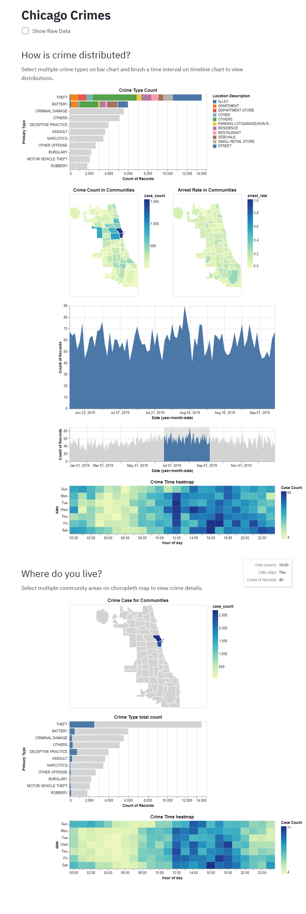

# Project name
<!-- 
 -->

<!-- TODO: Short abstract describing the main goals and how you achieved them. -->

## Project Goals

In this project, we want to answer following questions: what frequency of different type of crimes happen in Chicago? How do crimes distribute in different community in Chicago？ How to crimes occur across time monthly, dately and hourly? What's the specific district(community area) crime information?

## Design

Our data includes both time and space information, also it contains some extra data like type, arrest state. Hence, we want to visualize the data mainly in two dimension, one is to visualize space information in geographic map, another one is to visualize the time change in area chart and heatmap. For other discrete feature, we use bar chart to present.

After choosing the visual encodings, we begin to aggregate them and add some interactions.

The fist interaction is to choose the type of crime. We use bar chart to present total records and allow user to multi select the types. The alternative way is to use sidebar, however, we think it doesn't display the count of crime for different type and support mutl selection. Hence, we choose bar chart with mutl selection finally.

Then, we will present geograpchical visualization for crimes count and arrest rate, this will be influenced by previous bar chart selection. We won't add interaction here, or it will be quite complex and complicated. We will add geographical map interaction later.

Next, we will add interaction for time. Our time data includes year, month, date, hour, minute. Hence, present them in a graph is impossible. Finally, we choose to use two graph, one area chart to present the everyday crime records, one heatmap to present the hours and weekday crime count. We add brush selection for day choice. By selecting ranges of days, we use another zoom area chart to present more detailed information as well as changing heatmap to display corresponding weekday and hour information. The alternative way is to use bar chart with multi selection. However, this solution might be less interactive and smooth, so we don't choose it.

Finally, we provided the geograpchical interaction by adding multiple selection on communities in map. The alternative solution is to use the longtitude and latigude to display the geographical map, however, it's hard to add interaction and the geographical map might be too complicated and confused. So, we use comminty area map with mutli selection instead. To provide deeper insights about the community crime details. We use heatmap to present time information and bar char to present type details. 

## Development

We fisrtly search for the dataset and learn how to use altair and streamlit. During this time, we also search some demo and learn the code. It took us 10 hours/people. Then, we discuss the dataset and  some possible design idea, it took us 5 hours/people. Then, we start develop our code, tong xiao developed a framework first, and zhanlin sun made modification and added graph, it took everyone 15 hours/people. During this time, we also try alternative methods. Finally, we write the final writeup, which took 2 hours/people